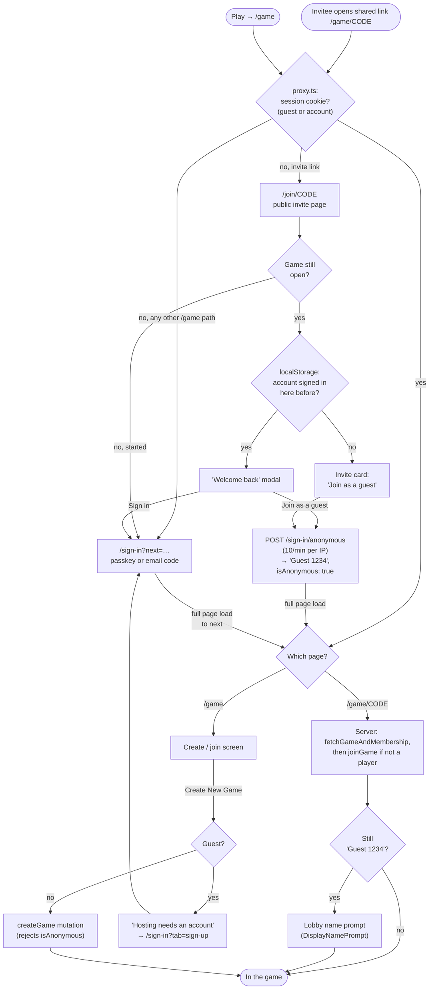
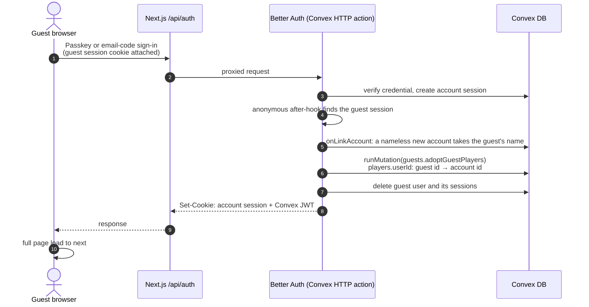

# The ID Game

A real-time party game for nights out — play it live at **[id-game.com](https://id-game.com)**.

One player secretly picks a scenario ("most likely to argue with their parents over something ridiculous…"), ranks everyone in the room by it, and the rest have to guess which scenario it was. Create a room, share the six-character join code, and play.

## Gameplay

1. Create a game room and share the join code
2. Wait for players to join
3. Each round:
   1. The round host receives 10 scenarios and picks one
   2. The host ranks all players most-to-least likely for that scenario
   3. The other players see the same 10 scenarios and the ranking
   4. Each player guesses which scenario the host picked
   5. Results are revealed once everyone has guessed
4. The host role rotates; play as many rounds as you set at creation

## Stack

| Layer    | Choice                                                                                                    |
| -------- | --------------------------------------------------------------------------------------------------------- |
| Frontend | [Next.js](https://nextjs.org) (App Router) · [Tailwind](https://tailwindcss.com) · [shadcn/ui](https://ui.shadcn.com) · [Dice UI](https://www.diceui.com) |
| Data     | [Convex](https://www.convex.dev) — reactive real-time database; game state syncs to all clients live       |
| Auth     | [Better Auth](https://better-auth.com) running **on** Convex — passkeys first, email one-time codes as fallback (delivered by [Resend](https://resend.com)) |
| Analytics| [PostHog](https://posthog.com)                                                                              |
| Hosting  | [Vercel](https://vercel.com) (app) + Convex Cloud (backend)                                                 |

## How auth works

There are no passwords. Accounts exist mainly to keep bots from creating and abandoning games, so sign-in is deliberately light — and people who only want to join a friend's game don't need one at all:

- **Guests** join from an invite link in one click, then pick a display name in the lobby, via Better Auth's [anonymous plugin](https://better-auth.com/docs/plugins/anonymous). Guests can **join** games but never **create** one: the UI offers them an account instead, and the `createGame` mutation refuses any caller whose JWT says `isAnonymous`. Guest sign-ins are rate-limited per IP (10 a minute).
- **Passkeys** (WebAuthn) are the primary method for accounts — including conditional-UI autofill from the email field on supporting browsers.
- **Email OTP** is the fallback and recovery path: a 6-digit code sent via Resend proves inbox ownership, which doubles as the sign-up bot gate. New users are registered on their first verified code.

Mechanically:

```
Browser ── /api/auth/* (Next.js catch-all route) ──▶ Convex HTTP actions (Better Auth core)
   │                                                        │
   └── Convex queries/mutations (JWT) ◀── trusts ───────────┘
```

- Better Auth runs on the Convex deployment itself via [`@convex-dev/better-auth`](https://labs.convex.dev/better-auth) (local-install component); auth tables live in Convex alongside game data.
- The Next.js route at `app/api/auth/[...all]` proxies auth requests to Convex, so sessions are same-origin cookies on the app domain.
- Convex functions authorise with `ctx.auth.getUserIdentity()` — `identity.subject` **is** the Better Auth user id, and is what `players.userId` / `games.createdBy` store. The JWT also carries the user row's fields, so `identity.isAnonymous` tells guests apart without a lookup.
- `proxy.ts` gates `/game*` on session-cookie presence (optimistic, fast); guests and accounts have the same cookie, so the authoritative checks are in the Convex functions.

Key auth files: `convex/auth.ts` (Better Auth config + plugins), `convex/http.ts` (route registration), `lib/auth-client.ts` / `lib/auth-server.ts` (client/server helpers), `app/(auth-routes)/sign-in/` (the single auth page), `components/guest-join.tsx` (the invite page's guest form), `convex/guests.ts` (moves a guest's seats onto their new account).

### Getting into a game



Guests name themselves in the lobby rather than on the invite page, so nothing stands between the link and the game: `DisplayNamePrompt` asks anyone still on their generated "Guest 1234", the same way it asks an account that has no name, and the name it saves is copied onto the cards they already have.

The "Welcome back" prompt stops a returning player from joining as a stranger to their own account. `components/remember-account.tsx` records a first name (never the email) in `localStorage` whenever an account — not a guest — is signed in, and signing out leaves it in place, because "this device has an account" is exactly what the invite page wants to know.

### Guest to account

A guest who signs in or signs up (from the user tray's "Create account", or the hosting prompt) keeps their seats. The anonymous plugin's after-hook sees the old guest session on the same request that creates the real one, and `onLinkAccount` moves the guest's `players` rows across before the plugin deletes the guest user. If the move fails, the sign-in fails with it, so the guest and their seats survive to retry.



If the account already has its own seat in one of those games, the account's seat wins and the guest's is retired (`active: false`), the same way consensus removal retires a player.

Guests who never sign up are cleaned up by the daily `delete expired guests` Convex cron (`deleteExpiredGuests` in `convex/cleanup.ts`): once a guest is 30 days old and every one of its sessions has expired, nobody can sign in as it again, so the user and its sessions are deleted. Its `players` rows stay, as game history. The admin users page counts guests separately from accounts.

## Local development

Assumes you know Convex and Next. From a fresh clone:

```sh
pnpm install
npx convex dev          # terminal 1 — creates/attaches a dev deployment
pnpm dev                # terminal 2
```

`.env.local`:

```env
# Convex (written by `npx convex dev` on first run)
CONVEX_DEPLOYMENT=<your-convex-deployment>
NEXT_PUBLIC_CONVEX_URL=<your-convex-url>
NEXT_PUBLIC_CONVEX_SITE_URL=<same-as-convex-url-but-.site>

# App
NEXT_PUBLIC_SITE_URL=http://localhost:3000

# Maintenance mode (optional)
MAINTENANCE_MODE=false
MAINTENANCE_BYPASS_SECRET=<random-string-16+-chars>

# PostHog
NEXT_PUBLIC_POSTHOG_KEY=<your-posthog-key>
NEXT_PUBLIC_POSTHOG_API_HOST=/ingest # DO NOT CHANGE
NEXT_PUBLIC_POSTHOG_UI_HOST=<your-posthog-host-url>
```

Auth env vars live on the **Convex deployment**, not in `.env.local`:

```sh
npx convex env set BETTER_AUTH_SECRET $(openssl rand -base64 32)
npx convex env set SITE_URL http://localhost:3000
npx convex env set RESEND_API_KEY <your-resend-key>
npx convex env set AUTH_EMAIL_FROM "The ID Game <onboarding@resend.dev>"
```

The game needs rows in the `scenarios` table to be playable — seed some via the Convex dashboard if your deployment is fresh. Schema lives in `convex/schema.ts`.

## Ops & deployment

- **Deploys:** Vercel builds the app on push; `npx convex deploy` pushes the backend. Set the four Convex-side env vars (above, with production values) **before** deploying — the backend fails fast with a `SITE_URL is not set` error otherwise.
- **Maintenance mode:** set `MAINTENANCE_MODE=true` in Vercel and redeploy — every route returns a 503 "back soon" page (crawler-correct, `Retry-After` set). Visit any URL with `?bypass=<MAINTENANCE_BYPASS_SECRET>` to set a cookie that lets you through for smoke-testing while the curtain is up. Flip back to `false` and redeploy to reopen.
- **Env var split:** `NEXT_PUBLIC_*` + maintenance vars live in Vercel; `BETTER_AUTH_SECRET`, `SITE_URL`, `RESEND_API_KEY`, `AUTH_EMAIL_FROM` live on the Convex deployment (`npx convex env set --prod …`).
